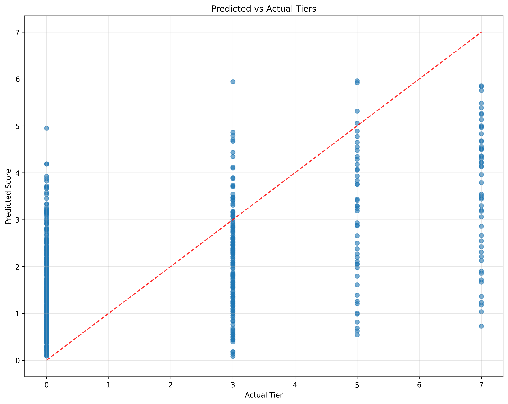
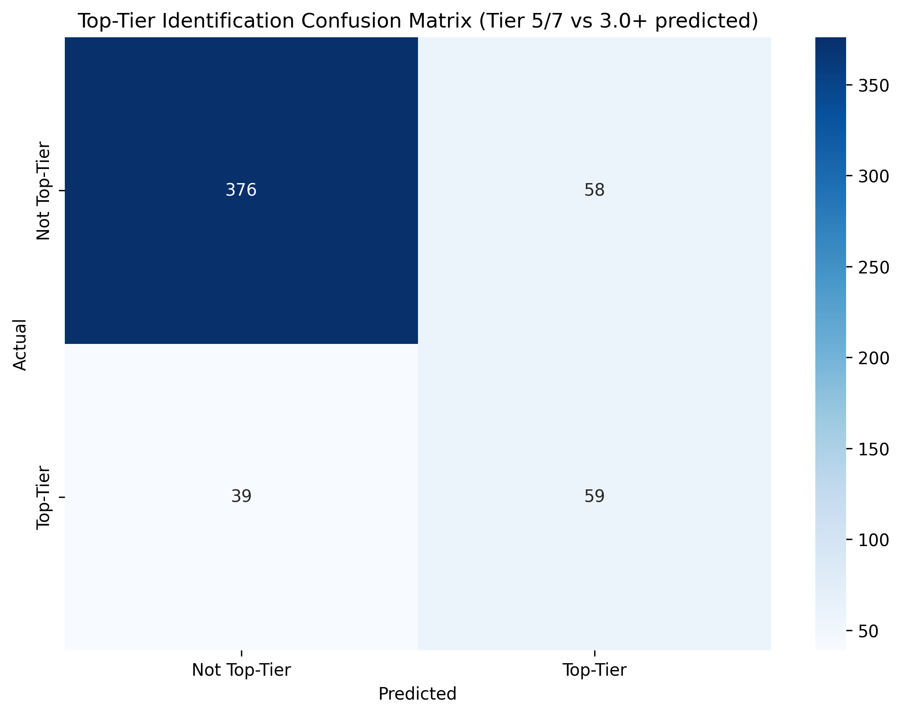

## NBA Draft Predictor

Try it out and see what it thinks about recent NBA drafts!

https://nba-draft-predictor.onrender.com/

Prospects were predicted using random forest regressors trained on data scraped from basketball & sports reference.

Players are split into general positions (guards, wings, bigs) and passed into position-specific models trained on college prospects drafted from 2011-2021. The predictions displayed for 2011-2021 drafts were done using leave-one-out cross validation.

For those who are interested in the:

- [Scraper](scraper/README.md)  
- [Models](models/README.md)  
- [Frontend](web/frontend/README.md)  
- [Backend](web/backend/README.md)

## Model Performance & Results

### Methodology

**Data Collection**: Each prospect had comprehensive data scraped including:
- NBA career stats
- Final college season stats
- Player metadata (age, height, weight, wingspan)
- NBA team stats during their draft year
- College team stats during their final season

**Career Scoring System**: A proprietary scoring system was developed to evaluate NBA career success:
```
Career Score = (0.5 × Games Started % + 0.3 × Points/G + 0.2 × Assists/G + 0.2 × Rebounds/G)
```
This score is normalized to a 0-100 scale and mapped to career tiers:
- **Tier 0**: Scrub (≤2 NBA seasons or score <26)
- **Tier 3**: Rotational Player (score 64-80)
- **Tier 5**: Strong Starter (score 80-90)
- **Tier 7**: All-Star (score ≥90)

**Position-Specific Models**: Separate Random Forest models were trained for three position groups:
- **Guards**: Point guards and shooting guards
- **Wings**: Small forwards and combo forwards  
- **Bigs**: Power forwards and centers

Each model uses position-optimized features including per-40-minute statistics to account for playing time variations.

### Performance Metrics

Based on historical data from 2011-2021 drafts, the model demonstrates strong predictive capabilities:

- **Overall Correlation**: 0.511 (rank correlation between predicted and actual career tiers)
- **Mean Absolute Error**: 1.68 tiers
- **Tier 5/7 Identification Accuracy**: 60.2% (identifying good players with a 3.0+ predicted value threshold)

**Note**: We prioritize rank correlation over absolute score accuracy because the inherent noise in career outcomes means absolute scores will always appear "lower" than they actually are. The 0.511 correlation indicates the model successfully ranks prospects in order of their career potential.

**Important Context**: These results are actually quite strong for NBA draft prediction. Pure statistical models will never perfectly predict NBA success due to the countless intangible factors (work ethic, injury luck, team fit, coaching, etc.). A 0.511 correlation means the model captures meaningful patterns that translate to real-world draft value.

### Performance Visualizations

The model generates four key visualizations that demonstrate its predictive capabilities:

#### 1. Predicted vs Actual Tiers (`predicted_vs_actual.png`)
This scatter plot shows how well the model's predictions align with actual career outcomes. While the scatter may appear "messy" with many points far from the diagonal, this is expected and normal for NBA draft prediction. The key insight is that players predicted as high-tier (top-right quadrant) are significantly more likely to become successful NBA players than those predicted as low-tier (bottom-left quadrant). The model's value lies in its ability to rank prospects, not predict exact career outcomes.

#### 2. Prediction Error Distribution (`error_distribution.png`)
This histogram displays the distribution of prediction errors (predicted tier - actual tier). The distribution shows that most predictions fall within ±2 tiers of actual outcomes, which is reasonable given the inherent uncertainty in NBA careers. The slight rightward skew suggests the model tends to be slightly optimistic about prospects, which is common in draft evaluation.

#### 3. MAE by Position Group (`mae_by_position.png`)
This bar chart shows the Mean Absolute Error (MAE) for each position group. Big men typically show higher MAE due to smaller sample sizes and the evolving role of centers in modern basketball. Guards and wings show more consistent prediction accuracy, likely due to larger training datasets and more stable position requirements.

#### 4. Top-Tier Identification Confusion Matrix (`confusion_matrix.png`)
This heatmap shows the model's ability to identify top-tier players (Tier 5+). The 60.2% accuracy means the model correctly identifies about 3 out of 5 future strong starters and all-stars. While this may seem low, it's actually quite strong for draft prediction and NBA teams would be thrilled with a 60% success rate on high-tier player identification.

### Visualization Examples


*Predicted vs Actual Tiers - Shows correlation between model predictions and actual career outcomes*


*Prediction Error Distribution - Displays the spread of prediction errors*


*MAE by Position Group - Shows prediction accuracy across different positions*


*Top-Tier Identification Confusion Matrix - Demonstrates ability to identify high-potential players*

### Key Findings

**Most Predictive Features**:
- **Box Plus-Minus (BPM)**: Consistently the strongest predictor across all positions.
- **Age**: Younger prospects consistently outperform older ones, even when controlling for other factors. This aligns with NBA teams' preference for drafting younger players with more development potential.
- **Per-40 Statistics**: Normalizing stats to per-40 minutes is crucial for fair comparisons, as playing time varies significantly across college programs and conferences.

**Practical Applications**:
- The model is most valuable for ranking prospects within position groups rather than making absolute predictions
- It can help identify "sleepers" (players predicted higher than their draft position) and "bust risks" (players predicted lower than their draft position)
- The 60.2% top-tier identification rate suggests the model could be a valuable tool for NBA front offices when used alongside traditional scouting

### Model Limitations

- Limited to college prospects (international players not included)
- Career scoring system is simplified and may not capture all aspects of NBA success
- Position classifications are broad and may not account for modern positionless basketball
- Historical data from 2011-2021 may not fully reflect current NBA trends

## License

This project is licensed under the Creative Commons Attribution-NonCommercial 4.0 International Public License.  
See [LICENSE](LICENSE) for the full terms.

## Project Structure

```
nba-draft-predictor
├── archive
├── data
│   ├── raw
│   └── cleaned
├── models
│   ├── training/
│   │   ├── train_and_LOO.py
│   │   └── test_and_LOO.py
│   ├── bigs.pkl
│   ├── guards.pkl
│   └── wings.pkl
├── scraper/
│   ├── extractors.py
│   ├── network.py
│   ├── scraper.py
│   └── main.py
├── web/
│   ├── backend/
│   │   ├── app.py
│   │   ├── Procfile
│   │   ├── requirements.txt
│   │   ├── results.csv
│   │   └── models/
│   │       ├── __init__.py
│   │       ├── bigs.pkl
│   │       ├── guards.pkl
│   │       ├── loader.py
│   │       └── wings.pkl
│   └── frontend/
│       ├── .gitignore
│       ├── package.json
│       ├── package-lock.json
│       ├── postcss.config.js
│       ├── tailwind.config.js
│       ├── public/
│       │   ├── favicon.ico
│       │   └── index.html
│       └── src/
│           ├── api.js
│           ├── App.js
│           ├── constants.js
│           ├── index.css
│           ├── index.js
│           ├── components/
│           │   ├── PlayerForm.js
│           │   └── ResultsTable.js
│           └── pages/
│               └── ResultsPage.js
├── .gitignore
├── README.md
├── requirements.txt
└── results.csv
```
