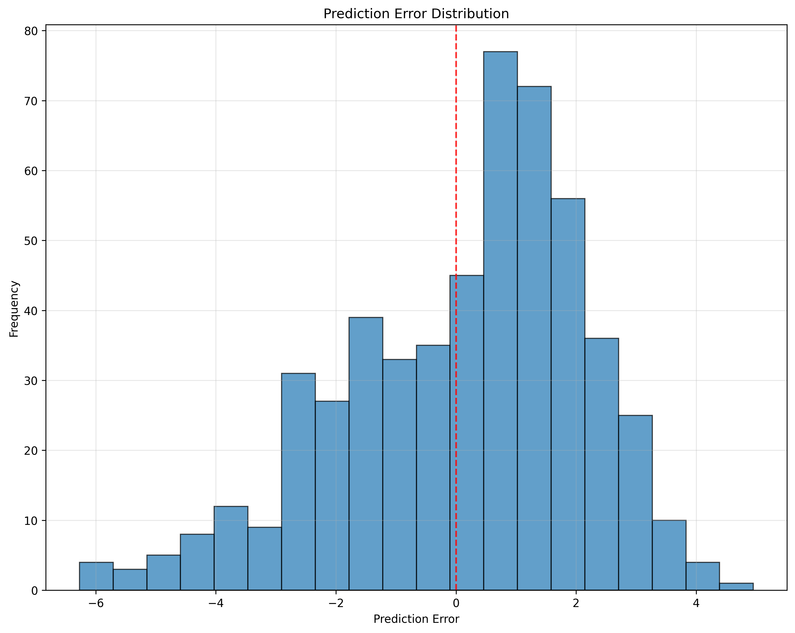
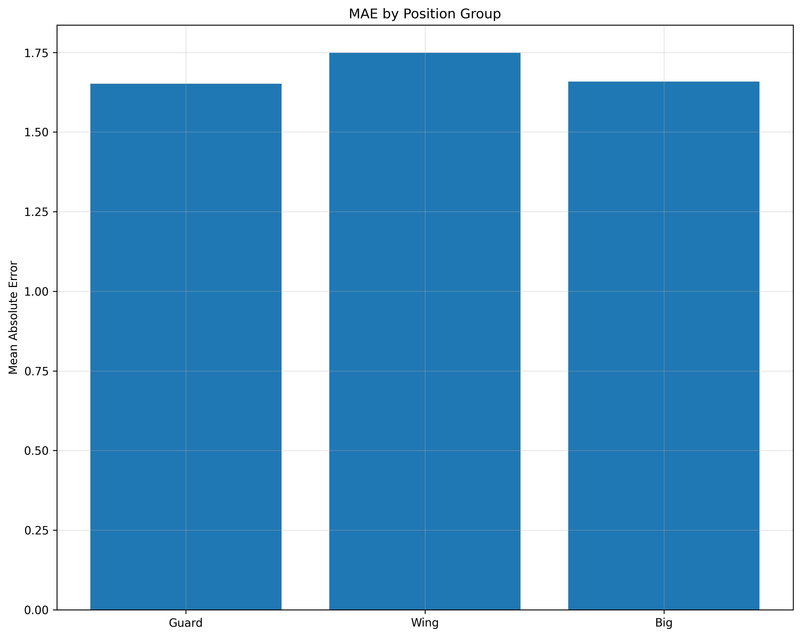

## NBA Draft Predictor

Try it out and see what it thinks about recent NBA drafts!

https://nba-draft-predictor.onrender.com/

Prospects were predicted using random forest regressors trained on data scraped from basketball & sports reference.

Players are split into general positions (guards, wings, bigs) and passed into position-specific models trained on college prospects drafted from 2011-2021. The predictions displayed for 2011-2021 drafts were done using leave-one-out cross validation.

## Methodology

**Data Collection**: Each prospect had comprehensive data scraped including:
- NBA career stats
- Final college season stats
- Player metadata (age, height, weight, wingspan)
- NBA team stats during their draft year
- College team stats during their final season

It was ultimately determined that this was too much noise, and final college season stats were sufficient.

**Career Scoring System**: A scoring system was developed to evaluate NBA career success:
```
Career Score = (0.5 × Games Started % + 0.3 × Points/G + 0.2 × Assists/G + 0.2 × Rebounds/G)
```
This score is normalized to a 0-100 scale and mapped to career tiers, then manually adjusted:
- **Tier 0**: Scrub (≤2 NBA seasons or score <26)
- **Tier 3**: Rotational Player (score 64-80)
- **Tier 5**: Strong Starter (score 80-90)
- **Tier 7**: All-Star (score ≥90)

**Position-Specific Models**: Separate Random Forest models were trained for three position groups:
- **Guards**: Point guards and shooting guards
- **Wings**: Small forwards and combo forwards  
- **Bigs**: Power forwards and centers

Each model uses position-optimized features including per-40-minute statistics to account for playing time variations.

## Model Performance & Results

### Performance Metrics

Based on 2011-2021 drafts:

- **Overall Correlation**: 0.511 (rank correlation between predicted and actual career tiers)
- **Mean Absolute Error**: 1.68 tiers
- **Tier 5/7 Identification Accuracy**: 60.2% (identifying good players with a 3.0+ predicted value threshold)

**Note**: Rank correlation is prioritized over absolute score accuracy because the inherent noise in career outcomes means absolute scores will always appear "lower" than they actually are. Pure statistical models will never perfectly predict NBA success due to countless intangible factors (work ethic, injury luck, team fit, coaching, etc.).

### Performance Visualizations

#### 1. Predicted vs Actual Tiers


This scatter plot shows how well the model's predictions align with actual career outcomes. While the scatter may appear "messy" with many points far from the diagonal, this is expected and normal for NBA draft prediction. The key insight is that players predicted as high-tier are certainly at least slightly more likely to become successful than those predicted as low-tier.

#### 2. Prediction Error Distribution



This histogram displays the distribution of prediction errors (predicted tier - actual tier). The distribution shows that most predictions fall within ±2 tiers of actual outcomes. The slight rightward skew suggests the model tends to be slightly optimistic about prospects, which is common in draft evaluation.

#### 3. MAE by Position Group



Relatively similar across all positions, but it is worth noting that Guards and Wings tend to have higher predicted scores than Big men due to the smaller sample size.

#### 4. Top-Tier Identification Confusion Matrix


This heatmap shows the model's ability to differentiate top-tier players (Tier 5+) from average/subpar players. The 60.2% accuracy means the model correctly identifies about 3 out of 5 future strong starters and all-stars.

### Key Findings

**Most Predictive Features**:
- **Box Plus-Minus (BPM)**: Consistently the strongest predictor across all positions.
- **Age**: Younger prospects consistently outperform older ones, even when controlling for other factors. This aligns with NBA teams' preference for drafting younger players with more development potential.
- **Per-40 Statistics**: Normalizing stats to per-40 minutes is crucial for fair comparisons, as playing time varies significantly across college programs and conferences.

**Practical Applications**:
- The model is most valuable for ranking prospects within position groups rather than making absolute predictions
- It can help identify "sleepers" (players predicted higher than their draft position) and "bust risks" (players predicted lower than their draft position)
- The 60.2% top-tier identification rate suggests the model could be a valuable tool for NBA front offices when used alongside traditional scouting

### Model Limitations

- Limited to college prospects (international players not included)
- Career scoring system is simplified and may not capture all aspects of NBA success
- Position classifications are broad and may not account for modern positionless basketball
- Historical data from 2011-2021 may not fully reflect current NBA trends

## License

This project is licensed under the Creative Commons Attribution-NonCommercial 4.0 International Public License.  
See [LICENSE](LICENSE) for the full terms.

## Project Structure

```
nba-draft-predictor
├── archive
├── data
│   ├── raw
│   └── cleaned
├── models
│   ├── training/
│   │   ├── train_and_LOO.py
│   │   └── test_and_LOO.py
│   ├── bigs.pkl
│   ├── guards.pkl
│   └── wings.pkl
├── scraper/
│   ├── extractors.py
│   ├── network.py
│   ├── scraper.py
│   └── main.py
├── web/
│   ├── backend/
│   │   ├── app.py
│   │   ├── Procfile
│   │   ├── requirements.txt
│   │   ├── results.csv
│   │   └── models/
│   │       ├── __init__.py
│   │       ├── bigs.pkl
│   │       ├── guards.pkl
│   │       ├── loader.py
│   │       └── wings.pkl
│   └── frontend/
│       ├── .gitignore
│       ├── package.json
│       ├── package-lock.json
│       ├── postcss.config.js
│       ├── tailwind.config.js
│       ├── public/
│       │   ├── favicon.ico
│       │   └── index.html
│       └── src/
│           ├── api.js
│           ├── App.js
│           ├── constants.js
│           ├── index.css
│           ├── index.js
│           ├── components/
│           │   ├── PlayerForm.js
│           │   └── ResultsTable.js
│           └── pages/
│               └── ResultsPage.js
├── .gitignore
├── README.md
├── requirements.txt
└── results.csv
```
